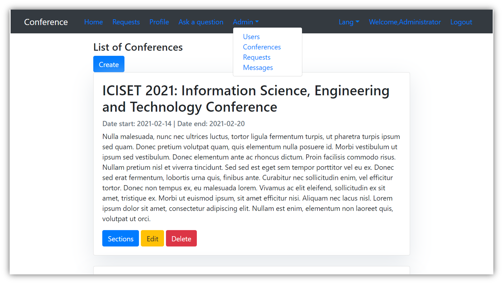
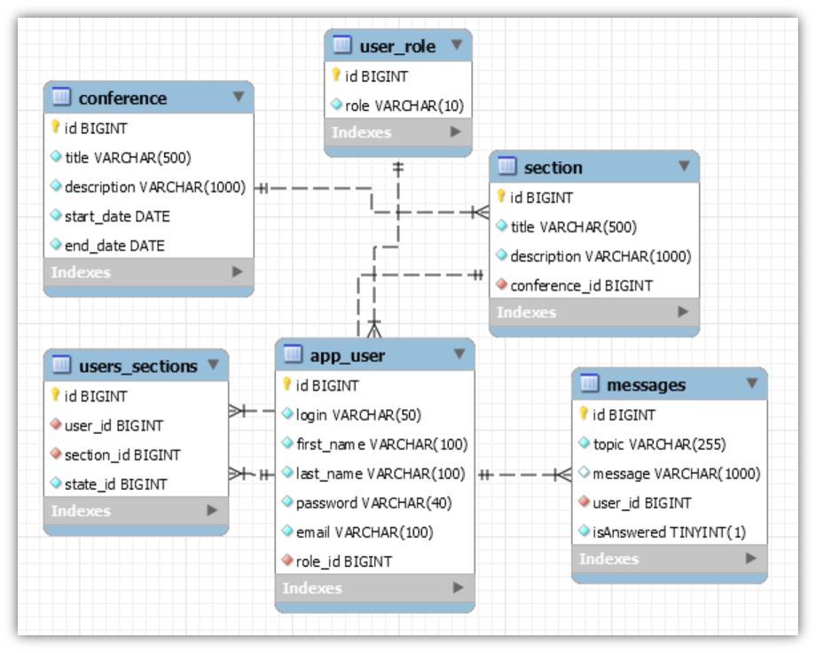
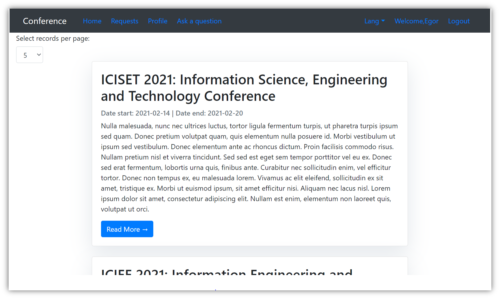
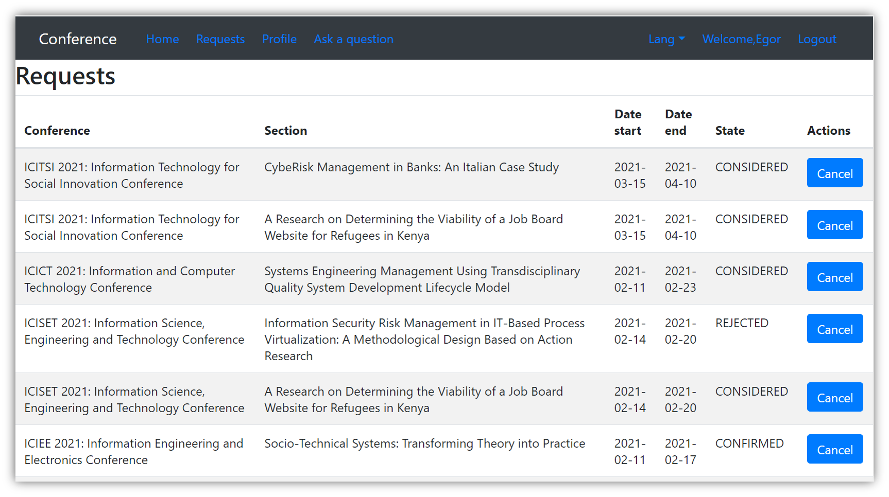
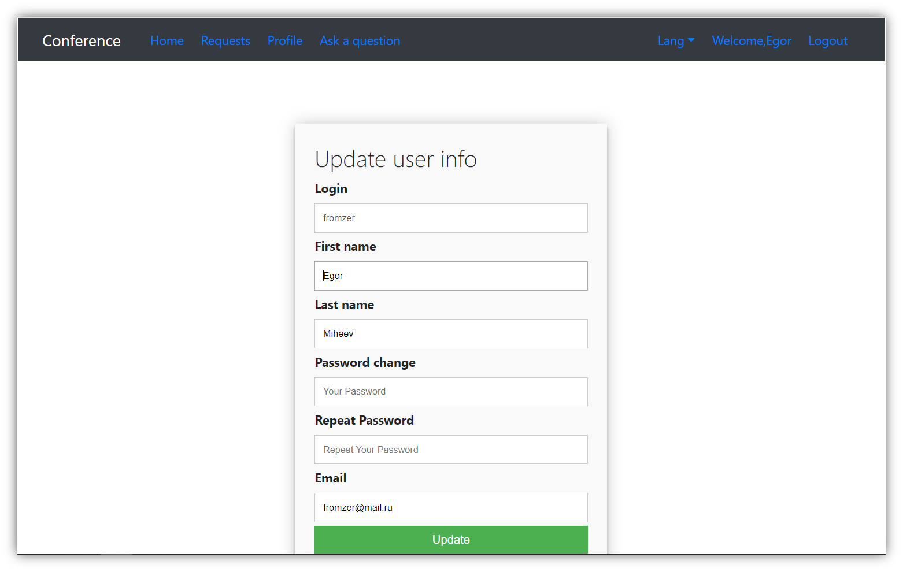

# Final Task. Web Project

* Приложение реализовать применяя технологии Servlet и JSP.
* Архитектура приложения должна соответствовать шаблонам Layered architecture и MVC. Controller может быть только двух видов: контроллер роли или контроллер приложения.
## Требования к БД
* Информация о предметной области должна хранится в БД:
* Если данные в базе хранятся на кириллице, рекомендуется применять кодировку utf-8
* Технология доступа к БД только JDBC
* Для работы с БД в приложении должен быть реализован потокобезопасный пул соединений, использовать synchronized и volatile запрещено.
* При проектировании БД рекомендуется использовать не более 6-8 таблиц
* Работу с данными в приложении осуществлять посредством шаблона DAO.
  
## Базовые требования к приложению
* Интерфейс приложения должен быть локализован; выбор из языков: EN|BE|RU etc.
* Приложение должно корректно обрабатывать возникающие исключительные ситуации, в том числе вести их лог. В качестве логгера использовать Log4J2/SLF4J
* Классы и другие сущности приложения должны быть грамотно структурированы по пакетам и иметь отражающую их функциональность название.
* При реализации бизнес-логики приложения следует при необходимости использовать шаблоны проектирования (например, шаблоны GoF: Factory Method, Command, Builder, Strategy, State, Observer, Singleton, Proxy etc).
* Для хранения пользовательской информации между запросами использовать сессию.
* Для перехвата и корректировки объектов запроса (request) и ответа (response) применить фильтры.
* Разрешается, но далеко не обязательно использовать технологии AspectJ и Web-services (в рамках внешнего тренинга эти темы не рассматриваются).
* При реализации страниц JSP следует использовать теги библиотеки JSTL, использовать скриплеты запрещено.
* При реализации пользовательского интерфейса разрешается использовать любые технологии front-end разработки (js, AJAX).
* Реализовать защиту от повторного выполнения запроса нажатием F5 и от js injection.
* Реализовать собственные теги. 
* Просмотр “длинных списков” желательно организовывать в постраничном режиме.
* Валидацию входных данных производить на клиенте и на сервере.
* Документацию к проекту необходимо оформить согласно требованиям javadoc.
* Оформление кода должно соответствовать Java Code Convention.
* При развертывании приложения разрешается использовать технологию Maven.
* Приложение должно содержать JUnit, (TestNG, Mockito или EasyMock студент может исползьвать по собственному желанию, в рамках курса эти темы не рассматриваются).
* Приложение должно быть размещено на удалённом git репозитории.
## Минимальные требования к функциональности приложения
* Авторизация (sign in) и выход (sign out) в/из системы.
* Регистрация пользователя и/или добавление артефакта предметной области системы.
* Просмотр информации (например: просмотр всех ставок тотализатора, статистики заказов, счетов и т.д.)
* Удаление информации (например: отмена заказа, удаление сущности и т.д.)
* Добавление и модификация информации (например: создать и отредактировать товар, создать и отредактировать заказ и т.д.)
* Во всех проектах где присутствуют финансовые отношения возможно использование оплаты в кредит
## Предметная область для разработки проекта
**Конференция**. **Администратор** создает конференцию, ее секции. **Участник** регистрируется и подает заявку в одну или более секций. **Администратор** проверяет заявку на соответствие тематике секции и подтверждает\отклоняет заявку. **Участник** может снять заявку, задать вопрос **Администратору**.

